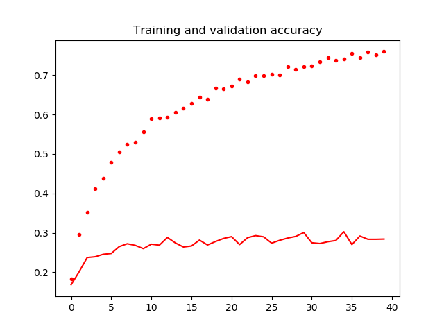
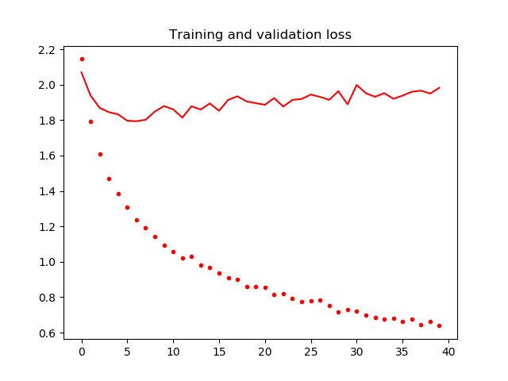
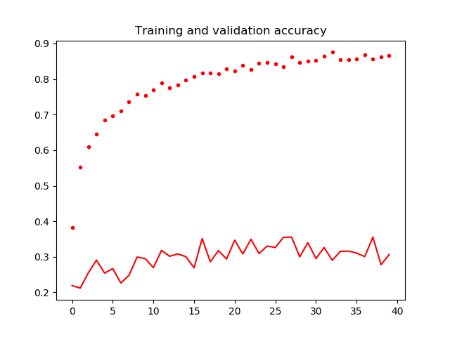
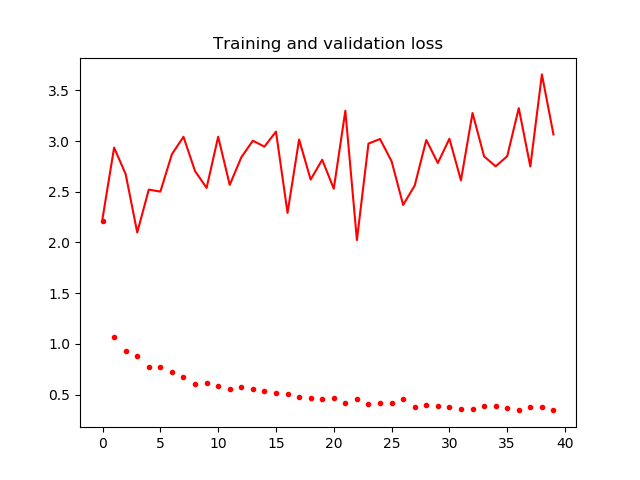
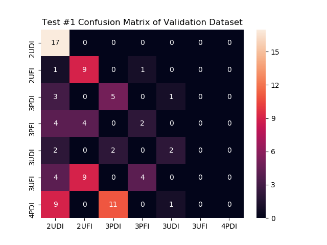
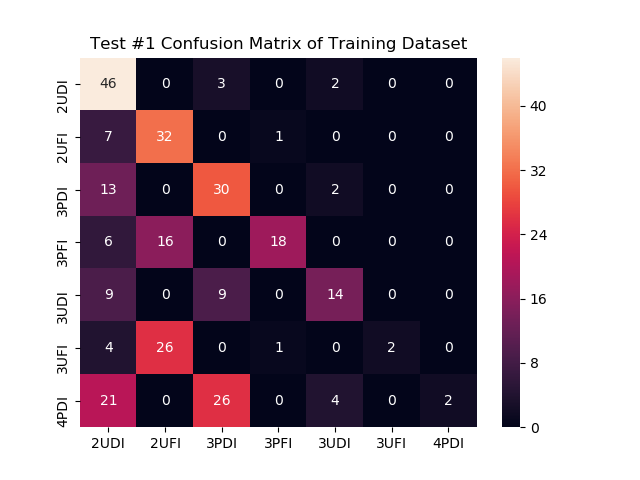
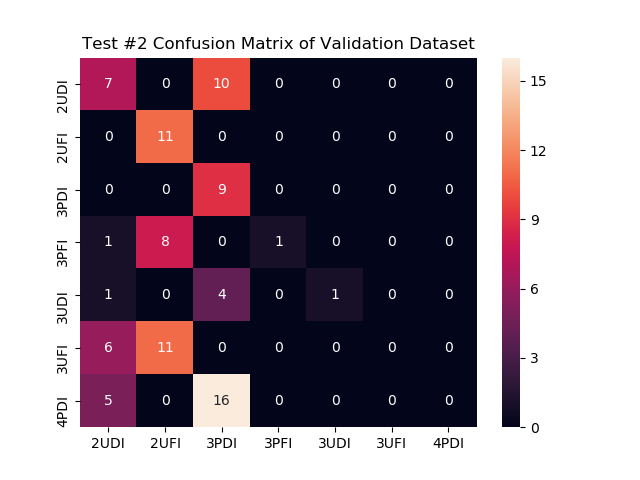
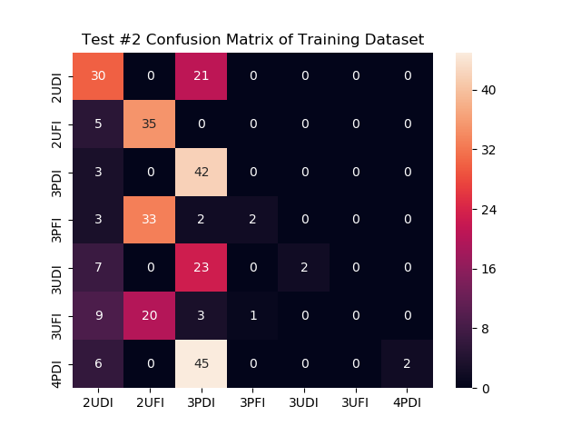
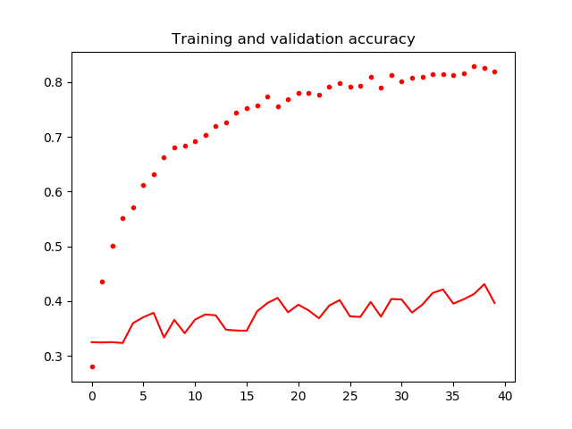
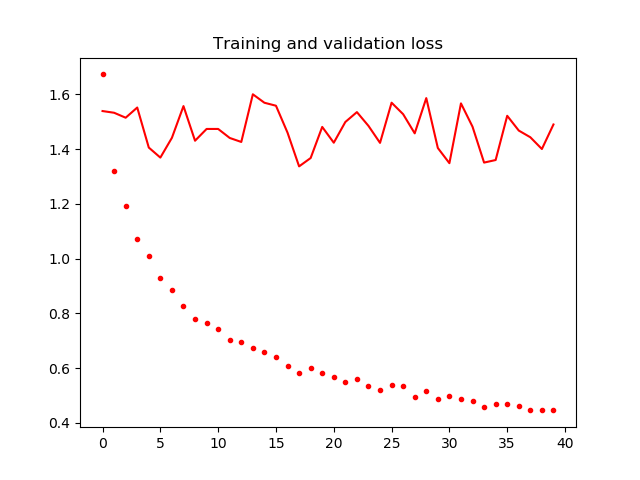

# All Tests
Keras with Tensorflow backend was chosen because it decreases the time needed for prototyping. Dataset argumentation was used for both sets.
```
    train_datagen = ImageDataGenerator(
        rotation_range=60,
        width_shift_range=0.2,
        height_shift_range=0.2,
        rescale=1./255,
        shear_range=0.2,
        zoom_range=0.2,
        horizontal_flip=True,
        fill_mode='nearest'
    )
```

# Phase 1
Validate the code and find the best candidate for this dataset.

## Tests

### Test #1 - Inception ResNet v2 (inception_resnet_v2)
- No dense layer. 
- Dropout: 0.5%
- Optimizer: Adam

### Test #2 - Inception v3 (inception_v3)
- No dense layer.
- Dropout: 0.5%
- Optimizer: Adam

### Test #3 - Inception v3 (fixed1_inception_v3)
- Dense Layer: 1024 (relu)
- Dropout: 0.5%
- Optimizer: Adam 

### Test #4 - Inception v3
- Dense Layer: 1024 (relu)
- Dropout: 0.5%
- Optimizer: Adam 

Result: Validation cross entropy didn't increased or decreased and validation accuracy too low to continue.
File: fixed2_inception_v3.png

### Test #5 - Inception v3
- Dense Layer: 1024 (relu)
- Dropout: 0.5%
- Optimizer: Adam (1e-5)

Results: Train accuracy increasing slowly and Train & Validation loss decreasing slowly. Validation accuracy didn't increase.
File: fixed3_inception_v3.png

### Test #6 - Inception v3 [ACCEPTABLE]
- Validation Dataset: 10%
- Training Dataset: 90%

#### Bottom Network
- Dense Layer: 1024 (elu)
- Dropout: 0.2%
- Dense Layer: 1024 (elu)
- Optimizer: SGD(lr=0.0001, momentum=0.9)

Results: Near 72% of train accuracy and 18% best validation accuracy.
Model: inception_v3.model
File: inception_v3/

### Test #7 - Inception Resnet v2
- Validation Dataset: 10%
- Training Dataset: 90%

#### Bottom Network
- Dense Layer: 1024 (elu)
- Dropout: 0.2%
- Dense Layer: 1024 (elu)
- Optimizer: SGD(lr=0.0001, momentum=0.9)

Results: Validation loss increasing with accuracy static at around 13%. Training accuracy 63%.
Model: inception_resnet_v2.model
File: inception_resnet_v2/

### Test #8 - Inception v3 [SUPER ACCEPTABLE]
- Smaller datasets were deleted, seven remaining.
- Validation Dataset: 25%
- Training Dataset: 75%

#### Bottom Network
- Dense Layer: 1024 (elu)
- Dropout: 0.2%
- Dense Layer: 1024 (elu)
- Optimizer: SGD(lr=0.0001, momentum=0.9)

Results: Validation & training loss decreasing and accuracy increasing. 27.69% Validation and 82.10% Training.
Model: inception_v3_reduced.model
File: inception_v3_reduced/

### Test #9 - Inception v3 
- Control run.
- Validation Dataset: 20%
- Training Dataset: 80%

#### Bottom Network
- Dense Layer: 1024 (elu)
- Dropout: 0.2%
- Dense Layer: 1024 (elu)
- Optimizer: SGD(lr=0.0001, momentum=0.9)

Results: With 2 epochs of 50 interations: 90.04% of validation and 92.13% of train accuracy.
Model: cats_and_dogs_v2.model
File: cats_and_dogs_control.png

### Test #10 - Inception v3 [SUPER ACCEPTABLE]
- Smaller datasets were deleted, seven remaining.
- Validation Dataset: 25%
- Training Dataset: 75%

#### Bottom Network
- Dense Layer: 1024 (relu)
- Dropout: 0.5%
- Dense Layer: 1024 (relu)
- Optimizer: Adam(1e-4)

Results: Validation & training loss decreasing and accuracy increasing. 34.74% Validation and 76.47% Training.
Model: inception_v3_reduced_alternative.model
File: inception_v3_reduced_alternative/

### Test #11 - Inception ResNet v2
- Smaller datasets were deleted, seven remaining.
- Validation Dataset: 25%
- Training Dataset: 75%

#### Bottom Network
- Dense Layer: 1024 (relu)
- Dropout: 0.5%
- Dense Layer: 1024 (relu)
- Optimizer: Adam(1e-4)

Results: Validation loss increasing and accuracy static over time.
File: inception_resnet_v2_reduced_alternative/

## Conclusions
- Inception ResNet v2 isn't suitable for this dataset. 
- Inception V3 was the best fit. 
- Adam at learning rate of 1e-4 worked really well.
- Dropout of 50% helped addressing the overfitting.
- Overfitting was a problem with the 10 classes dataset.
- Deleting classes with unsulficient samples (<50) helped increase the accuracy.
- Data argumentation helped but more samples are needed to reach a reasonable accuracy.

## Future
- SGD@(lr=0.0001, momentum=0.9) can be further tunned.
- Elu vs Relu can be explored further.
- VGG19 & VGG16 can be a nice fit. 
- Experimenting with more nn layers.

# Phase 2
Repeat SUPER ACCEPTABLE with four times more epochs.

### Test #1 - Inception v3 
- Previously Test #8 at Phase 1.
- Smaller datasets were deleted, seven remaining.
- Validation Dataset: 25%
- Training Dataset: 75%

#### Bottom Network
- Dense Layer: 1024 (elu)
- Dropout: 0.2%
- Dense Layer: 1024 (elu)
- Optimizer: SGD(lr=0.00001, momentum=0.9)

#### Results
After seven epochs the validation loss started rising indicating that overfitting occured. Max validation accuracy was 30.04% and 75.94% of train accuracy.

| Epoch  | Train Loss | Validation Loss | Train Accuracy | Validation Accuracy |
|:------:|:----------:|:---------------:|:--------------:|:-------------------:|
| 01     | 2.1469     | 2.0699          | 18.37%         | 16.83%              |
| 02     | 1.7955     | 1.9389          | 29.29%         | 20.12%              |
| 03     | 1.6120     | 1.8689          | 34.87%         | 23.73%              |
| 04     | 1.4793     | 1.8453          | 40.48%         | 23.93%              |
| 05     | 1.3837     | 1.8329          | 43.78%         | 24.55%              |
| 06     | 1.3071     | 1.7970          | 47.73%         | 24.76%              |
| 07     | 1.2429     | 1.7941          | 50.25%         | 26.51%              |
| 08     | 1.1864     | 1.8018          | 52.89%         | 27.23%              |
| 09     | 1.1476     | 1.8489          | 52.91%         | 26.81%              |
| 10     | 1.0907     | 1.8794          | 55.65%         | 25.99%              |
| 11     | 1.0560     | 1.8612          | 58.97%         | 27.12%              |
| 12     | 1.0248     | 1.8145          | 58.74%         | 26.87%              |
| 13     | 1.0365     | 1.8785          | 58.99%         | 28.82%              |
| 14     | 0.9817     | 1.8600          | 60.31%         | 27.43%              |
| 15     | 0.9742     | 1.8945          | 61.51%         | 26.40%              |
| 20     | 0.8600     | 1.8961          | 66.65%         | 28.56%              |
| 25     | 0.7828     | 1.9198          | 69.54%         | 29.98%              |
| 30     | 0.7329     | 1.8894          | 72.35%         | 30.06%              |
| 35     | 0.6776     | 1.9209          | 74.14%         | 30.26%              |
| 40     | 0.6392     | 1.9826          | 75.94%         | 28.41%              |

#### Files
| Files                                  | Description                                             |
|:---------------------------------------|:--------------------------------------------------------|
| inception_v3_phase2.model              | Final Keras trained model file                          |
| inception_v3/accuracy.png              | Validation and Train Accuracy Plot                      |
| inception_v3/loss.png                  | Validation and Train Loss Plot                          |
| inception_v3/nohup.out                 | Log of everything printed by the train.py               |
| inception_v3/train.py                  | The exactly same Keras file used to train this model    |

#### Training Plots



### Test #2 - Inception v3 [BEST]
- Previously Test #10 at Phase 1.
- Smaller datasets were deleted, seven remaining.
- Validation Dataset: 25%
- Training Dataset: 75%

#### Bottom Network
- Dense Layer: 1024 (relu)
- Dropout: 0.5%
- Dense Layer: 1024 (relu)
- Optimizer: Adam(1e-4)

#### Results 
Validation loss increased but the mean validation accuracy was ~30%. Training accuracy was ~87%. Better overall performance but still presented overfitting meaning that the dataset is very limited. 

| Epoch  | Train Loss | Validation Loss | Train Accuracy | Validation Accuracy |
|:------:|:----------:|:---------------:|:--------------:|:-------------------:|
| 01     | 2.1942     | 2.2363          | 38.15%         | 21.92%              |
| 02     | 1.0721     | 2.9361          | 54.90%         | 21.20%              |
| 03     | 0.9378     | 2.6741          | 61.01%         | 25.53%              |
| 04     | 0.8873     | 2.0986          | 64.33%         | 29.08%              |
| 05     | 0.7736     | 2.5220          | 68.72%         | 25.42%              |
| 06     | 0.7767     | 2.5018          | 69.73%         | 26.71%              |
| 07     | 0.7134     | 2.8707          | 71.34%         | 22.65%              |
| 08     | 0.6641     | 3.0430          | 73.95%         | 24.81%              |
| 09     | 0.6048     | 2.7044          | 75.67%         | 29.95%              |
| 10     | 0.6153     | 2.5385          | 75.33%         | 29.49%              |
| 11     | 0.5891     | 3.0431          | 76.73%         | 26.97%              |
| 12     | 0.5583     | 2.5683          | 78.58%         | 31.81%              |
| 13     | 0.5766     | 2.8397          | 77.32%         | 30.16%              |
| 14     | 0.5636     | 3.0044          | 78.03%         | 30.83%              |
| 15     | 0.5367     | 2.9452          | 79.77%         | 30.06%              |
| 20     | 0.4519     | 2.8166          | 82.88%         | 29.39%              |
| 25     | 0.4209     | 3.0211          | 84.59%         | 33.04%              |
| 30     | 0.3874     | 2.7842          | 84.96%         | 33.97%              |
| 35     | 0.3868     | 2.7514          | 85.33%         | 31.60%              |
| 40     | 0.3454     | 3.0657          | 86.63%         | 30.62%              |

#### Files
| Files                                  | Description                                             |
|:---------------------------------------|:--------------------------------------------------------|
| inception_v3_alternative_phase2.model  | Final Keras trained model file                          |
| inception_v3_alternative/accuracy.png  | Validation and Train Accuracy Plot                      |
| inception_v3_alternative/loss.png      | Validation and Train Loss Plot                          |
| inception_v3_alternative/nohup.out     | Log of everything printed by the train.py               |
| inception_v3_alternative/train.py      | The exactly same Keras file used to train this model    |

#### Training Plots



## Conclusions 
The test number two presented better accuracy over time. Both models encountered problems with overfitting even with different classes of optimizers, dropout values and nn activators. More dataset samples are needed. 

# Phase 3
Generate accuracy tests with predict.py and generate confusion matrix.

### Test #1 - Inception v3 [BEST]
Analysis of Test #1 of Phase 2.

#### Bottom Network
- Dense Layer: 1024 (elu)
- Dropout: 0.2%
- Dense Layer: 1024 (elu)
- Optimizer: SGD(lr=0.00001, momentum=0.9)

#### Predictions 
| Dataset        | Accuracy     |
|:---------------|:-------------|
|Train           |48.98%        |
|Validation      |38.46%        |

#### Confusion Matrix



### Test #2 - Inception v3 
Analysis of Test #2 of Phase 2.

#### Bottom Network
- Dense Layer: 1024 (relu)
- Dropout: 0.5%
- Dense Layer: 1024 (relu)
- Optimizer: Adam(1e-4)

#### Predictions 
| Dataset        | Accuracy     |
|:---------------|:-------------|
|Train           |38.43%        |
|Validation      |31.87%        |

#### Confusion Matrix



## Conclusions 
The tests revealed that the Test #1 have more accuracy. The classes 3UFI and 4PDI are lowering the overall accuracy. Removing them in the next phase. 

# Phase 4

### Test #1 - Inception v3 [BEST]
Re-training Phase 2 Test #1 CNN (Inception v3) with 5 clases discading 3UFI and 4PDI for accuracy concerns.

#### Bottom Network
- Dense Layer: 1024 (elu)
- Dropout: 0.2%
- Dense Layer: 1024 (elu)
- Optimizer: SGD(lr=0.00001, momentum=0.9)

#### Training Results
The accuracy improved compared to the last phase. Validation loss is static as fast and training loss decreasing as it should, no overfitting detected here. Max validation accuracy is 43.11% and ~38% mean. Max training accuracy is 82.35%. Both accuracies were increasing with a linear rate.

| Epoch  | Train Loss | Validation Loss | Train Accuracy | Validation Accuracy |
|:------:|:----------:|:---------------:|:--------------:|:-------------------:|
| 01     | 1.6832     | 1.5387          | 27.65%         | 32.49%              |
| 05     | 1.0287     | 1.4054          | 56.19%         | 35.96%              |
| 10     | 0.7967     | 1.4733          | 65.97%         | 34.13%              |
| 15     | 0.7013     | 1.5691          | 72.00%         | 34.62%              |
| 20     | 0.5992     | 1.4808          | 76.52%         | 37.95%              |
| 25     | 0.5488     | 1.4225          | 78.12%         | 40.18%              |
| 30     | 0.5176     | 1.4038          | 80.30%         | 40.38%              |
| 35     | 0.5153     | 1.3598          | 78.25%         | 42.12%              |
| 40     | 0.4653     | 1.4897          | 81.59%         | 43.11%              |

#### Training Plots




#### Files
| Files                                  | Description                                             |
|:---------------------------------------|:--------------------------------------------------------|
| best_phase4.model                      | Final Keras trained model file                          |
| phase_4/accuracy.png                   | Validation and Train Accuracy Plot                      |
| phase_4/loss.png                       | Validation and Train Loss Plot                          |
| phase_4/results.txt                    | Log of everything printed by the train.py               |
| phase_4/train_p4.py                    | The exactly same Keras file used to train this model    |

#### Predictions 
| Dataset        | Accuracy     |
|:---------------|:-------------|
|Train           |        |
|Validation      |        |

#### Confusion Matrix


